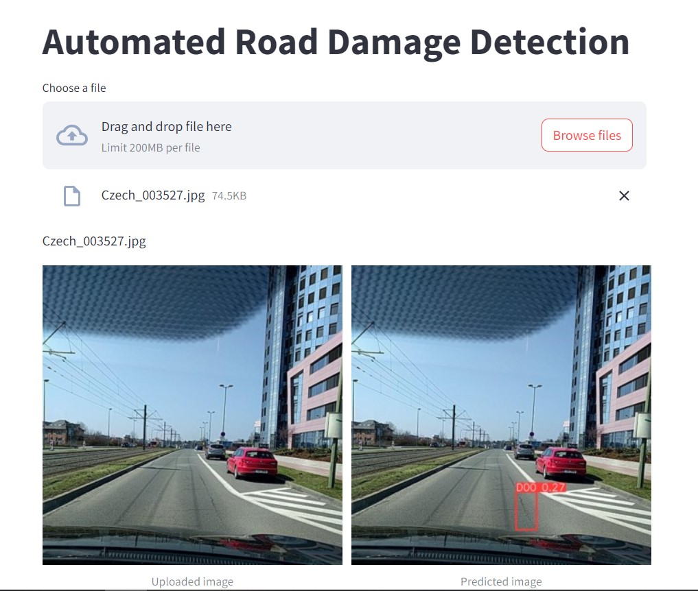

# TRINIT-JAHR_TNH-ML
### Automated Road Damage Detection for Infrastructure Maintenance using YOLO v8

We employed the Czech Road Damage Dataset for our project on automated road damage detection for infrastructure maintenance. The dataset comprises four classes: D00 for Longitudinal Crack, D10 for Transverse Crack, D20 for Alligator Crack, and D40 for Pothole. Annotations provided in XML format were converted to YOLO format using Roboflow.

To facilitate training, we converted the provided XML format annotations to YOLO format using the Roboflow tool. Subsequently, the training dataset was split into an 80:20 ratio for training and validation purposes.

For model training, the YOLOv8 architecture was employed, specifically utilizing the yolov8x.pt file. We chose yolov8x because of it's huge parameter size of 68.2M parameters and architecture size employed during training. 

Link for the best weights file: https://drive.google.com/drive/folders/15MzzdN5KipBYKt5wx7urGs1_dPhNl-D6?usp=sharing

### Image of the Web App

